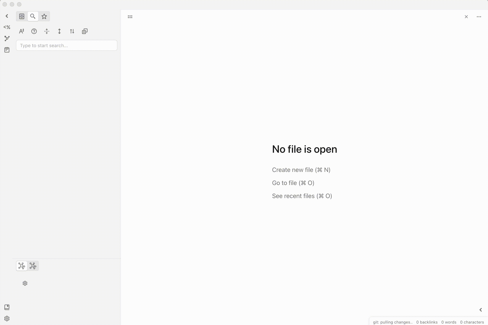

## Obsidian Ripgrep

**NOTE** This plugin assumes you already have ripgrep installed on your computer!

Please follow [their installation](https://github.com/BurntSushi/ripgrep#installation) instructions if this is not the case

In a shell, type `which rg` and copy the result into the settings for Obsidian Ripgrep.

